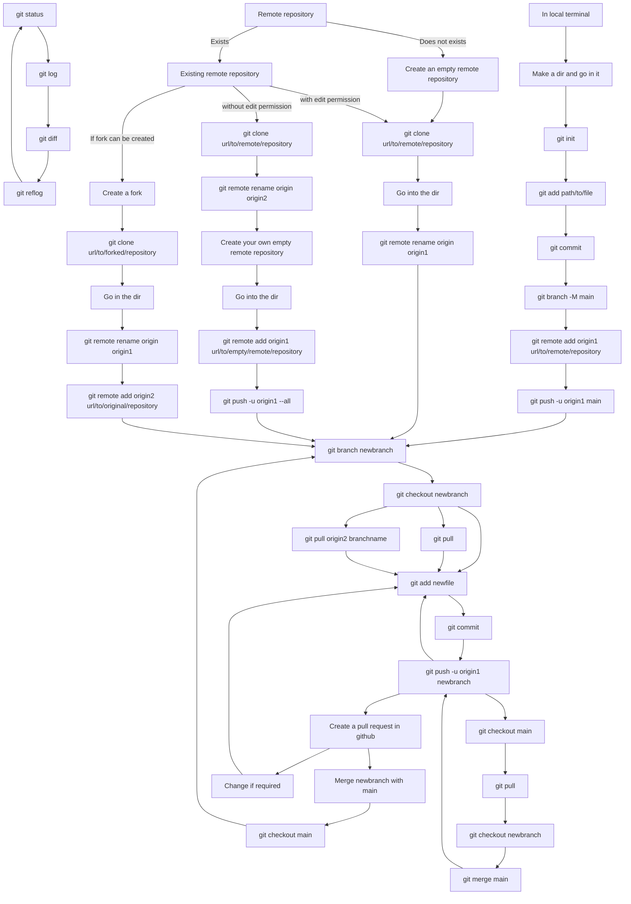

# Some useful git commands and the use of those

*Here I listed some of the git commands and how to use them efficiently or not-efficiently. Git supposed to be for all. This tutorial is thus probably not for professionals.*

The main goal of `git` is that one does need to create new file or folder to keep track of the evolution (or changes) of a project.

The crucial byproduct of this notions is that; `git` also can track the evolution of a project with multiple contributors.

**AND Yes, you can use git without github or bitbucket!!! These are required when you want to push your code to remote repository.**

For me, I use `git` along with `github`  also for coping the codes between two or more terminals. It is really quicker and efficient than use `rsync` for these small ASCII files.


## Flow of git methods:
There are mainly three ways to initialise a `local` git repository. Please continue reading for more details.


### Local Repository:
A git `repository` is synonymous to a `folder` or `directory`, but actually not. A git repository resides inside a folder, and that is the end of the similarity. We do not want to create multiple copy of the same objects when moving to a new versions.

So, we create a folder/directory named `useful_git_commands`. Then we go inside it. We then execute the following command.
```
git init
```
This creates a directory named `.git` inside `useful_git_commands` and fills it with all the necessary objects. **We, amateurs, must never cause any harm to this one.**

### Create a readme file:
In git, it is must to have a `README.md` file. It should be in plain ASCII. Please follow [this link](https://docs.github.com/en/get-started/writing-on-github/getting-started-with-writing-and-formatting-on-github/basic-writing-and-formatting-syntax) to know how to format this file.

### Make git to track a file:
Git does not automatically track all the files in a repository. We need to `add` the specific files to `git`.
A file can be added to `git` using the following command,
```
git add README.md
```

### First commit:
We have added one file to git. Now we need to commit it. Execute the following command to commit.
```
git commit -am "First Commit"
```
**Note**:
- If you do not use the `-a` flag, only the files in the staged are are committed. There may be situations where some modified files might be in the `unstaged` area. You need to execute `git add path/to/file` to bring them into staging are. And then commit using `git commit -m "some message"`. This is useful if you need to commit files separately.
- If you do not use the `-m` flag, an editor (i.e. nano, vim, etc.) will be opened. Write the message there. Then save and exit. Commit is over. You can change the choice of default editor.

### Check the status of git:
The following command display the status. Any files modified, staged or unstaged are displayed here.
```
git status
```
You will notice that the branch name is `master`. We usually change it to `main` for the default branch. For this, execute the following command.
```
git branch -M main
```

Now we are ready to `push` this to a `remote repository`.

### Remote Repository:
This will be an exact copy of the local repository. For this,
- You need to have account on a `git` server (i.e. `github`, `bitbucket`, `gitlab`, etc.).
- Upload your `SSH Keys` to the servers. Follow [this link](https://github.com/suryamondal/ssh_and_github) for details.
- You need to create an empty repository in server (say, `useful_git_commands`).
- Copy the link of the remote (find it in Clone->SSH tab). Then

Execute the following command to add a `remote` repository to your `local` repository. 
```
git remote add origin1 git@github.com:suryamondal/useful_git_commands.git
```
Where, `origin1` is sort of an alias to the remote repository. You can have as many as `origin`s if you want to push/pull from any of them. This is particularly useful if you want to keep a copy of your code to a separate repository.

### Push to a remote repository:
To push the branch `main` to `origin1`, execute the following.
```
git push -u origin1 main
```

### Clone a remote repository to local terminal:
Now say, you pushed a branch to `origin1` from a different terminal. You want to get the it to a new terminal.
Just execute the following.
```
git clone git@github.com:suryamondal/useful_git_commands.git
```
This will create a directory named `useful_git_commands` with all the files and `.git` folder.

**Warning:** In this local repository, the alias to `remote` is set as `origin` by default. You might rename it using `git remote rename origin origin1`. 

### Pull the changes from a remote, you pushed from a different terminal
```
git pull                : if you want to pull from the default remote
git pull origin1 main   : if you want to pull from a specific remote and branch
```

### Creating a new branch
Now we are in the `main` branch. **We should never edit the main branch directly**. Always create a branch, edit and test everything there. Then merge it to the `main` using a `pull request`.

To create a branch say, `bugfix/add-menu`, use the following command.
```
git branch bugfix/add-menu
```

Go to the branch using,
```
git checkout bugfix/add-menu
```

Then commit, push, pull using this branch name.

## Pull Requests
Once your branch is ready and working, it is time to merge it with the `main`. For this,
- First create a `pull request` in `github`. You may add reviewers for this operation.
- Discussion thread is available in each pull request. Discuss anything if there is conflicts.
- Do the changes required, commit, push; if required, then multiple time.
- With each push, the pull request will also get updated.
- Once all the reviewers have approved the request, you can go ahead to `merge` your branch with `main`.

## Forks
If you do not have permission to edit a remote repository, there are two ways to get it to your own remote.
1. Clone it, then push it to your own remote repository.
   - Add the original remote as `origin2`.
   - You can `pull` from the `origin2`, in case any changes in there.
   - Both are detached, and thus cannot be compared directly.
2. Create a `fork` of that remote, and then `clone` the `fork`. This gives the following added advantages.
   - You will be able to compare both the repositories.
   - You can create a `pull request` from `origin1` to `origin2`.

# GIT DIFF
This is probably the most interesting command of all, if used properly. It can be used in may way.
- `git diff` : It shows the changes you have done after the last commit
- `git diff main` : This shows the (committed) difference between `main` and this branch.
- any other possible combinations.
### GIT LOG
I usually push the changes to remote, and then browse it on a browser to check the logs. But one might can execute `git log` to see the commit log.

### GIT REFLOG
This shows the position of `head`. This is useful if you want to reset to any previous commit, using `git reset --hard bd6903f`. But please try not use it.
